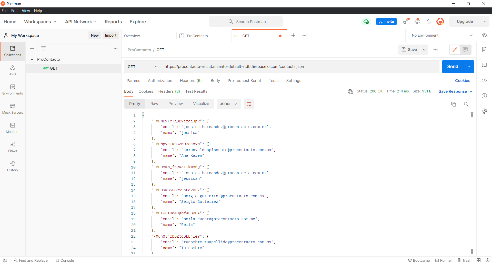
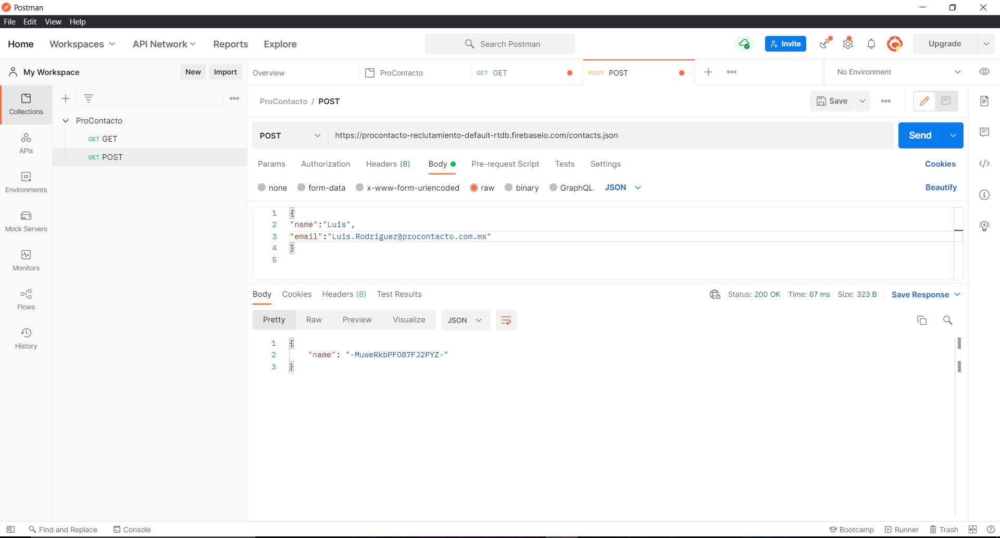

## ProContacto
> Evaluación Práctica

**EJERCICIO 2**

1.	¿Qué es un servidor HTTP?
      - Un ordenar que puede almacenar, enviar o recibir información, se basan en el modelo "cliente-servidor".
2.	¿Qué son los verbos HTTP? Mencionar los más conocidos
      - Son acciones que podemos hacer y el servidor debe responder tales como: get, post, put, delete, head, entre otros.
3.	¿Qué es un request y un response en una comunicación HTTP? ¿Qué son los headers? 
      - El navegador establece una conexión con el servidor y realiza el request, el servidor se encarga de evaluar el request y de enviar un response.
      - Los headers son la parte central de un request y un response, donde tranportan información acerca del cliente.
4.	¿Qué es un queryString? (En el contexto de una url)
      - Es una cadena de datos que pasan por la web y hace interacción con la base de datos.
5.	¿Qué es el responseCode? ¿Qué significado tiene los posibles valores devueltos?
      - Como su nombre lo indica es un código de respuesta y te devuelve si la solicitud fue concretada o errónea.
      - Entre los valores más comunes son: 404 no encontrado, 202 aceptado, 401 no autorizado.
6.	¿Cómo se envía la data en un Get y cómo en un POST? 
      - Get: Se envían por medio de una url y son visibles.
      - Post: Los datos no son visibles para el cliente, se envían en "segundo plano".
7.	¿Qué verbo http utiliza el navegador cuando accedemos a una página?
      - 200
8.	Explicar brevemente qué son las estructuras de datos JSON y XML dando ejemplo de estructuras posibles.
      - Son estructuras para intercambiar información entre servidor y web.
9.	Explicar brevemente el estándar SOAP
      - Protocolo para el intercambio de información basado en XML, el cliente o el servidor hacer una petición mediante HTTP.
10.	Explicar brevemente el estándar REST Full
      - Es un estandar que funciona para compartir información de forma "doble" request y response.
11.	¿Qué son los headers en un request? ¿Para qué se utiliza el key Content-type en un header?
      - Contienen información del cliente y de la solicitud: verbos HTTP, url, versión.

**EJERCICIO 3**

1. Se realizoó un request GET a la URL indicada en el documento.
- 
3. Posteriormente se realizó el request POST a la URL anterior.
- 
4. Y finalmente nuevamente se realizó un request GET a la URL con los resultados.
- 
5. ¿Qué diferencias se observan entre las llamadas el punto 1 y 3?
      - Se agregaron el nombre y el correo indicados en postman.

**EJERCICIO 4**

Link del perfil Trailhead [Luis Rodriguez](https://trailblazer.me/id/luisg3545).

**EJERCICIO 5**

Conceptos

1.	Lead
      - Es un potencial cliente que demostró interés en un producto o servicio.
2.	Account
      - Almacena la información sobre sus clientes mediante cuentas y contactos.
3.	Contact
      - Almacenar información acerca de personas con las que puedes hacer negocios.
4.	Opportunity
      - Son acuerdos en curso los registros de oportunidad realizan un seguimiento de detalles acerca de acuerdos.
5.	Product
      - Son los elementos y servicios que se distribuye a clientes.
6.	PriceBook
      - Son listas de precios de los productos y servicios que ofrece la compañía.
7.	Quote
      - Representa los precios propuestos de los servicios y productos de la compañía.
8.	Asset
      -  Representa un producto específico adquirido o instalado.
9.	Case
      - Es una pregunta, un comentario o un problema de un cliente.
10.	Article
      -  Permite a los usuarios ver y votar un artículo individual después de seleccionarlo en los resultados de búsqueda.

[Driagrama](Driagrama.png)

**EJERCICIO 6**

Soluciones de Salesforce

1.	¿Qué es Salesforce?
      - Es un grupo de tecnologías que admite el desarrollo de otras tecnologías sobre ella. 
2.	¿Qué es Sales Cloud?
      - Es una aplicación de Salesforce, basada en la nube, de gestión de las relaciones con los clientes (CRM), con diversas herramientas.
3.	¿Qué es Service Cloud?
      - Es una aplicación para la atención al cliente y diversas nubes adicionales para ayudar a las compañías a dar cobertura a sus funciones de negocio.
4.	¿Qué es Health Cloud?
      - Es una aplicación de Salesforce para servicios de salud.
5.	¿Qué es Marketing Cloud?
      - Es una aplicación de Salesforce que las pymes y grandes empresas pueden utilizar para invertir en estrategias de email marketing de nivel profesional.

Funcionalidades de Salesforce

1.	¿Qué es un RecordType?
      - Nos permiten definir diferentes Business Process, Pages Layouts y Picklist Values en un determinado objeto y/o información.
2.	¿Qué es un ReportType?
      - Representa los metadatos asociados con un tipo de informe personalizado. Los tipos de informes personalizados le permiten crear un marco a partir del cual los                    usuarios pueden crear y personalizar informes.
3.	¿Qué es un Page Layout?
      - Nos permite controlar el diseño y la organización de botones, campos, s-controls, Visualforce, enlaces personalizados y listas relacionadas en páginas de                          registros de objetos.
4.	¿Qué es un Compact Layout?
      - Un formato compacto muestra los campos clave de un registro de un vistazo en la aplicación móvil Salesforce.
5.	¿Qué es un Perfil?
      - Creación de una cuenta y definen cómo acceden los usuarios a objetos y datos y qué pueden hacer en la aplicación.
6.	¿Qué es un Rol?
      - Los roles controlan el nivel de visibilidad que un usuario tiene sobre los datos de una organización. 
7.	¿Qué es un Validation Rule?
      - Las reglas de validación verifican que los datos ingresados por usuarios en registros cumplen los estándares que especifica antes de poder guardarlos.
8.	¿Qué diferencia hay entre una relación Master Detail y Lookup?
      - No se pueden establecer permisos de objeto de perfil para un registro detallado.
9.	¿Qué es un Sandbox?
      - Es una copia de una organización en un entorno aislado que puede usar para distintos fines, como pruebas y capacitación.
10.	¿Qué es un ChangeSet?
      - Es un conjunto de cambios que se ha enviado de alguna organización de Salesforce a otra organización en la que ha iniciado sesión.
11.	¿Para qué sirve el import Wizard de Salesforce?
      - Para comprobar datos antes de importarlos.
12.	¿Para qué sirve la funcionalidad Web to Lead?
      - Es un formulario de sitio web para capturar información del visitante y almacenar esa información como un nuevo cliente potencial en Salesforce.
13.	¿Para qué sirve la funcionalidad Web to Case?
      - Recopilar las solicitudes de servicio de atención al cliente de tu web y configurar Casos Web, formulario web, entre otros.
14.	¿Para qué sirve la funcionalidad Omnichannel?
      -  Permite ofrecer una experiencia de cliente fluida en distintos canales integrándolos en un único sistema.
15.	¿Para qué sirve la funcionalidad Chatter?
      - Es una aplicación de colaboración en tiempo real de Salesforce que permite a sus usuarios trabajar juntos, comunicarse y compartir información.

Conceptos generales

1.	¿Qué significa SaaS?
      - Software como un Servicio.
2.	¿Salesforce es Saas?
      - Si.
3.	¿Qué significa que una solución sea Cloud?
      - Que se maneja en la nube.
4.	¿Qué significa que una solución sea On-Premise?
      - Se maneja de manera local y la empresa y/u organización en la encargada de dar soluciones o darle mantenimiento.
5.	¿Qué es un pipeline de ventas?
      - Método que ayuda a la empresa a dar un mejor manejo en cada uno de los pasos con sus clientes.
6.	¿Qué es un funnel de ventas?
      - Es utilizado por las empresas para establecer alguna tarea o proceso y llegar a un punto final, enfocada a usuarios.
7.	¿Qué significa Customer Experience?
      - Es la experiencia del cliente y/o usuario después de utilizar tu producto.
8.	¿Qué significa omnicanalidad?
      - Es la atención al cliente, pero por distintos canales de comunicación.
9.	¿Qué significa que un negocio sea B2B?¿Qué significa que un negocio sea B2C?¿Qué es un KPI?
      - B2B: Comercialización de un producto y/o servicio de una empresa a otra
      - KPI: Indicador clave o medidor de desempeño, su objetivo es facilitar tomar decisiones acerca de algun proyecto o proceso, tomando en cuenta diversos factores.
10.	¿Qué es una API y en qué se diferencia de una Rest API?
      - Las API permiten que varias elementos de software se conecten entre sí e intercambien información.
      - Las Rest API acceden a informaciónn mediante protocolos REST estándar.
11.	¿Qué es un Proceso Batch?
      - Es un proceso por medio de lotes por medio de un comando y/o algoritmo que ayuda con la eficiencia de algún proceso, sin la necesidad de interactuar con un                         usuario.
12.	¿Qué es Kanban?
      - Método para una mejor gestión de diversas tareas.
13.	¿Qué es un ERP? 
      - Aplicación que permite mejorar o automatizar procesos en empresas y/u organizaciones.
14.	¿Salesforce es un ERP?
      - Si.

**EJERCICIO 7**

[Trigger](Trigger)

## COLABORADOR

Luis Gustavo Rodriguez Rosales.

Licenciatura en Ingeniería en Sistemas Computacionales.

## License
[LICENSE](LICENSE)
